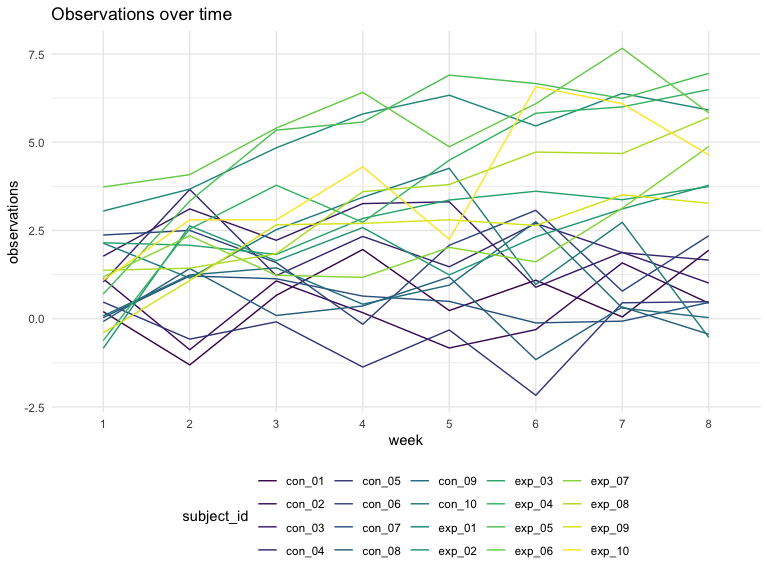
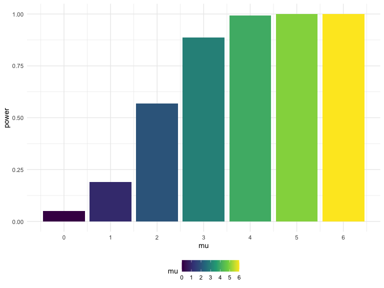
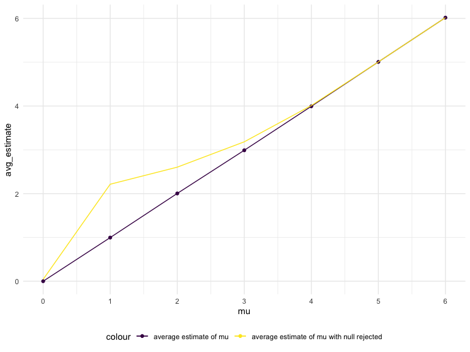

Homework 5
================
Yue Liu
2020-11-18

## Problem 1

Read in the data

``` r
homicide_df = 
  read_csv("data/homicide-data.csv") %>% 
  mutate(
    city_state = str_c(city, state, sep = "_"),
    resolved = case_when(
      disposition == "Closed without arrest" ~ "unsolved",
      disposition == "Open/No arrest"        ~ "unsolved",
      disposition == "Closed by arrest"      ~ "solved"
    )
  ) %>% 
  select(city_state, resolved) %>% 
  filter(city_state != "Tulsa_AL")
```

    ## Parsed with column specification:
    ## cols(
    ##   uid = col_character(),
    ##   reported_date = col_double(),
    ##   victim_last = col_character(),
    ##   victim_first = col_character(),
    ##   victim_race = col_character(),
    ##   victim_age = col_character(),
    ##   victim_sex = col_character(),
    ##   city = col_character(),
    ##   state = col_character(),
    ##   lat = col_double(),
    ##   lon = col_double(),
    ##   disposition = col_character()
    ## )

look at this a bit

``` r
aggregate_df  =
  homicide_df %>% 
  group_by(city_state) %>% 
  summarize(
    hom_total = n(),
    hom_unsolved = sum(resolved == "unsolved")
  ) %>% 
  arrange(hom_total)
```

    ## `summarise()` ungrouping output (override with `.groups` argument)

prop test for a single city

``` r
prop.test(
  aggregate_df %>% filter(city_state == "Baltimore_MD") %>% pull(hom_unsolved),
  aggregate_df %>% filter(city_state == "Baltimore_MD") %>% pull(hom_total)) %>% 
  broom::tidy()
```

    ## # A tibble: 1 x 8
    ##   estimate statistic  p.value parameter conf.low conf.high method    alternative
    ##      <dbl>     <dbl>    <dbl>     <int>    <dbl>     <dbl> <chr>     <chr>      
    ## 1    0.646      239. 6.46e-54         1    0.628     0.663 1-sample… two.sided

try to iterate…

``` r
result_df = 
  aggregate_df %>% 
  mutate(
    prop_tests = map2(.x = hom_unsolved, .y = hom_total, ~prop.test(x = .x, n = .y)),
    tidy_tests = map(.x = prop_tests, ~broom::tidy(.x))
  ) %>% 
  select(-prop_tests) %>% 
  unnest(tidy_tests) %>% 
  select(city_state, estimate, conf.low, conf.high)
```

``` r
result_df %>% 
  mutate(city_state = fct_reorder(city_state, estimate)) %>% 
  ggplot(aes(x = city_state, y = estimate)) +
  geom_point() +
  geom_errorbar(aes(ymin = conf.low, ymax = conf.high)) +
  theme(axis.text.x = element_text(angle = 90, vjust = 0.5, hjust = 1))
```


``` r
city_prop_test = function(df){
  
  n_unsovled ... 
  n_total ...
    
  prop.test(...)
}

homicide_df = 
  read_csv("data/homicide-data.csv") %>% 
  mutate(
    city_state = str_c(city, state, sep = "_"),
    resolved = case_when(
      disposition == "Closed without arrest" ~ "unsolved",
      disposition == "Open/No arrest"        ~ "unsolved",
      disposition == "Closed by arrest"      ~ "solved"
    )
  ) %>% 
  select(city_state, resolved) %>% 
  filter(city_state != "Tulsa_AL") %>% 
  nest(data = resolved)
```

    ## Error: <text>:3:14: unexpected symbol
    ## 2:   
    ## 3:   n_unsovled ...
    ##                 ^

## Problem 2

``` r
data_1 = read_csv("lda_data/con_01.csv")
```

    ## Parsed with column specification:
    ## cols(
    ##   week_1 = col_double(),
    ##   week_2 = col_double(),
    ##   week_3 = col_double(),
    ##   week_4 = col_double(),
    ##   week_5 = col_double(),
    ##   week_6 = col_double(),
    ##   week_7 = col_double(),
    ##   week_8 = col_double()
    ## )

``` r
path_df =
  tibble(
    path = list.files("lda_data")
) %>% 
  mutate(
    path = str_c("lda_data/", path),
    data = map(.x = path, ~read_csv(.x)),
    group_status = str_sub(path, -10, -8),
    group_status = case_when(
      group_status == "con" ~ "control",
      group_status == "exp" ~ "experimental"),
    subject_id = str_sub(path, -10, -5)
    ) %>% unnest() %>% 
  pivot_longer(
    week_1:week_8,
    names_to = "week",
    values_to = "observations"
  ) %>% 
  mutate(week = str_remove(week, "week_")) %>% 
  select(-path) %>% 
  relocate(subject_id, group_status, week, observations)
```

``` r
path_df %>% 
  ggplot(aes(x = week , y = observations, group = subject_id, color = subject_id)) +
  geom_line() +
  labs(title = "Observations over time") 
```



From the plot we see that while the observations for the experiment
group increases with time, the observations for control group stays
relatively stable.

## Problem 3

``` r
set.seed(1)

simulation_df =
  tibble(mu = c(0:6)) %>%
  mutate(
    input_lists = map(.x = mu, ~rerun(5000, rnorm(30, mean = .x, sd = 5)))) %>% 
  unnest(input_lists) %>% 
    mutate(t_tests = map(.x = input_lists, ~ t.test(.x)),
           tidy_tests = map(.x = t_tests, ~broom::tidy(.x))) %>% 
  unnest(tidy_tests) %>% 
  janitor::clean_names() %>% 
  select(mu, estimate, p_value)
```

From the plot below we can see that the power increases as the effect
size increases.

``` r
graph_df =
  simulation_df  %>% 
  group_by(mu) %>% 
  mutate(
    decision = case_when(
      p_value < 0.05 ~ "reject",
      p_value  >= 0.05 ~"fail to reject"
    ))

graph_df %>% 
  filter(decision == "reject") %>% 
  summarize(power = n()/5000) %>% 
  ggplot(aes(x = mu, y = power, fill = mu)) +
  geom_bar(stat = "identity") +
  scale_x_continuous(breaks = c(0:6)) 
```

    ## `summarise()` ungrouping output (override with `.groups` argument)



``` r
p1 = 
  graph_df %>% 
  group_by(mu) %>% 
  summarize(
    avg_estimate = mean(estimate)
  ) %>% 
  ggplot(aes(x = mu, y = avg_estimate)) +
  geom_line() + 
  geom_point() +
  scale_x_continuous(breaks = c(0:6)) +
  scale_y_continuous(breaks = c(0:7)) 
```

    ## `summarise()` ungrouping output (override with `.groups` argument)

``` r
p2 =
  graph_df %>% 
  group_by(mu) %>% 
  filter(decision == "reject") %>% 
  summarize(
    avg_rej_estimate = mean(estimate)
  ) %>% 
  ggplot(aes(x = mu, y = avg_rej_estimate)) +
  geom_line() + 
  geom_point() +
  scale_x_continuous(breaks = c(0:6)) +
  scale_y_continuous(breaks = c(0:7)) 
```

    ## `summarise()` ungrouping output (override with `.groups` argument)

``` r
ggplot() +
  geom_point( 
    data = graph_df %>% 
      group_by(mu) %>% 
      summarize(avg_estimate = mean(estimate)),
    aes(x = mu, y = avg_estimate, color = "average estimate of mu")
    ) +
  geom_point() + 
  geom_path(
    data = graph_df %>% 
      group_by(mu) %>% 
      summarize(avg_estimate = mean(estimate)),
    aes(x = mu, y = avg_estimate, color = "average estimate of mu")
  ) +
  geom_path(
    data = graph_df %>% 
      group_by(mu) %>% 
      filter(decision == "reject") %>% 
      summarize(avg_rej_estimate = mean(estimate)),
  aes(x = mu, y = avg_rej_estimate, color = "average estimate of mu with null rejected")
  ) + 
  scale_x_continuous(n.breaks = 7)
```

    ## `summarise()` ungrouping output (override with `.groups` argument)
    ## `summarise()` ungrouping output (override with `.groups` argument)
    ## `summarise()` ungrouping output (override with `.groups` argument)



From the plot we can see that the sample average of estimated mu across
test for which the null is rejected is approximately equal to the true
value of mu when mu equals 0, 4, 5, 6. However, the sample average of
estimated mu across test for which the null is rejected deviated
greathly from the true value of mu when mu equals 1, 2, and 3.
